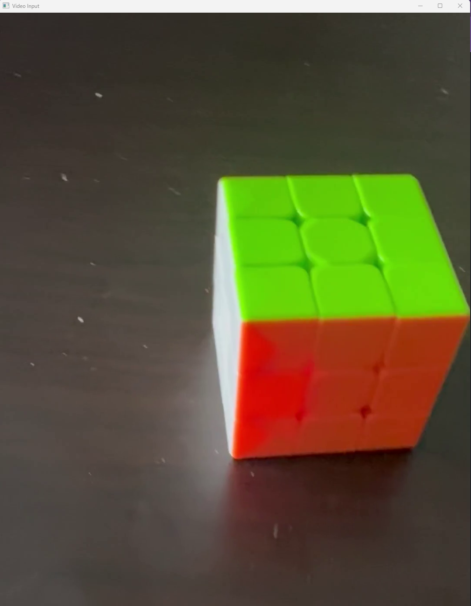
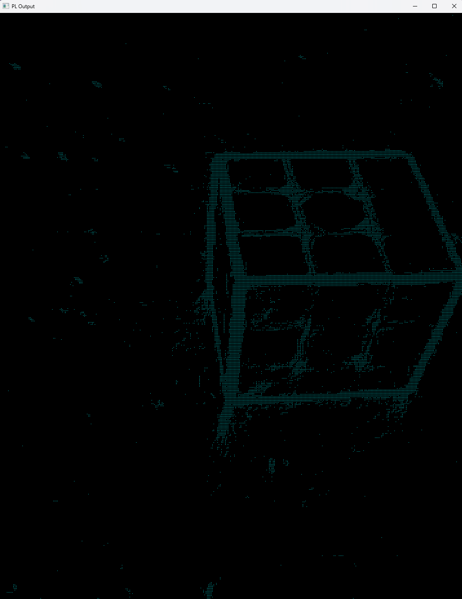

# Video Rendering Application
## Objective 
- Create an an application to recieve a video input encapsulating some real-world 3D space and create a near identical virtual replica in real time.
## Implementation
- This application uses OpenCV to read from a video file and structure the data for processing.
- Then, the structured data is passed into CUDA kernels which determine the vertice points of objects visible in the video.
- These vertice points are next passed to OpenGL to be rendered in a 3D space. Upon vertice render, the same colors, shading, and light sources will be applied to create a realistic representation of the original scene.
- Finally, a series of neural networks will be implemented to find points that the logic based CUDA kernels missed and pass the newfound data to OpenGL. 
## Progress
- The OpenCV code is tentativly finished. OpenCV currently reads frames from a video file, places the pixel data in data structures / containers for use in both the CUDA kernels and neural network(s).
- I have recently finished / validated logic based CUDA kernels in the 2D and 3D real-world domain. 
- I am currently transfering the second screenshot below over to a virtual 3D space rendered by GLFW. Once, I can replay the primary objects in real-time there, all that's left is to plot the video around a central axis point and implement neural networks to detect the primary objects in the video! 

## First Frame Input

## First Frame Output

